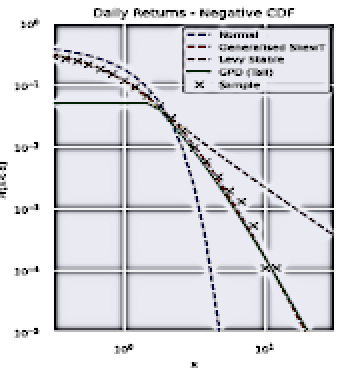

<a id="readme-top"></a>
<div align="center">
  <a href="https://github.com/TimWilding/FinanceDistributions">
    
  </a>
</div>

<details>
  <summary>Table of Contents</summary>
  <ol>
    <li>
      <a href="#Finance-Distributions">About The Project</a>
      <ul>
        <li><a href="#distributions">Distributions</a></li>
        <li><a href="#robust-correlations">Robust Correlations</a></li>
        <li><a href="#allocation-routines">Allocation Routines</a></li>
        <li><a href="#built-with">Built With</a></li>
      </ul>
    </li>
    <li>
      <a href="#getting-started">Getting Started</a>
      <ul>
        <li><a href="#prerequisites">Prerequisites</a></li>
        <li><a href="#installation">Installation</a></li>
      </ul>
    </li>
    <li><a href="#usage">Usage</a></li>
    <li><a href="#contact">Contact</a></li>
  </ol>
</details>

## Finance Distributions

[](https://opensource.org/licenses/MIT)

Finance Distributions is a set of useful calculations and plots for statistical distribution used in financial models. There are a set of univariate 
distributions that include skewness and kurtosis parameters. There are some routines for calculating robust correlations, and some simple allocation 
recipes for using those routines.

See instructions for getting started below. 

### Distributions
The following distributions are added:
* *LevyStableInterp* - an interpolated version of the Levy Stable distribution for fast fitting
* *GeneralisedSkewT* - an analytical distribution with skewness and fat tails that can be used for models
* *EntropyDistributions* - a generalisation of the Normal Distribution to include skewness and kurtosis based on the principles of maximum entropy
* *MeixnerDistribution* - a Generalised HyperSecant Distribution that includes skewness and kurtosis parameters. Includes fast random variable generation using rejection sampling bsaed on the method of Grigoletto
* *Johnson SU* - the unbounded version of the Johnson distribution

* *fit_tail_model* - fits a Generalised Pareto Distribution to the tail of a particular sample (Extreme Value Theory)

* *PRIIPSCalcs* - calculations for PRIIPS statistics

### Robust Correlations
There are also routines for calculation of useful multivariate statistics relating to correlation
* *Multivariate T-Distribution* - multivariate distribution including fat tails
* *correlations* - various adjustments for serial correlation in financial returns

### Allocation Routines
There are also some routines for asset allocation
* *Black-Litterman* - Black-Litterman asset-allocation with full testing
* *robust_pf* - robust portfolio optimisation using adjusted utility function

### Statistical Plots
And a few useful plotting routines for statistical fitting:
* *plot_qq* - multiple qq plots on a single figure
* *plot_hist* - multiple distribution comparisons on a single histogram
* *plot_log_cdf* - plots the Cumulative Density Function tails and compares to the sample
* *plot_hist_fit* - plot a histogram with the theoretical fit
* *plot_ks* - CDFs with Kolmogorov-Smirnov test applied
<p align="right">(<a href="#readme-top">back to top</a>)</p>


### Built With


* 
<p align="right">(<a href="#readme-top">back to top</a>)</p>


<!-- GETTING STARTED -->


## Getting Started

Install Python locally. 

### Prerequisites

Please make sure you have Python installed on your system.
* Python 3.10


### Installation
If you would like to use the package locally, please:
1. Clone the repo
   ```sh
   git clone https://github.com/TimWilding/FinanceDistributions.git
   ```
2. Install Python package, start in the top-level package directory
   ```sh
   pip install .
   ```
3. Start your Python coding
   ```sh
   # Fit Johnson SU distribution to a returns array
   import FastDistributions as fd
   jsu = fd.JohnsonSU.fitclass(ret_val) # ret_val is an array of equity market returns
   ```


### Usage

There are a variety of example Jupyter notebooks available. Please see:
* Generalised Skew-T -  https://colab.research.google.com/drive/12qVk4Dtt5uyoWGHk1aUT-_J257qXfXRz?usp=sharing for an example of fitting the 
Generalised Skew-T and the Levy-Stable distributions to equity market returns.
* Robust Correlations - https://colab.research.google.com/drive/1ujzWr-77CfduNeqmcSP84_xR79d1HxPd?usp=sharing for an example of fitting robust correlation matrices
* Black Litterman - https://colab.research.google.com/drive/1fd2FSpaY5m2ysXFrOZ0qeyI79gLyCEqo?usp=sharing for an example of using the Black-Litterman in practice
* Robust Allocation - https://colab.research.google.com/drive/15VaMidw0e9YswpWMUpi_gYcDL5UGdaIJ?usp=sharing for an example of using robust allocations

### Contact
Please contact Tim Wilding if you have any questions or suggestions. Thanks for any feedback.
<p align="right">(<a href="#readme-top">back to top</a>)</p>