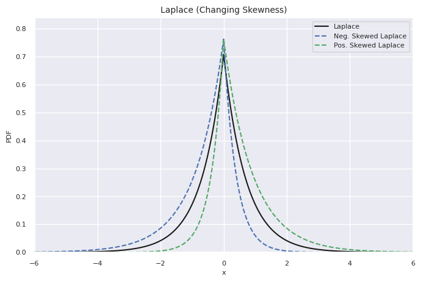
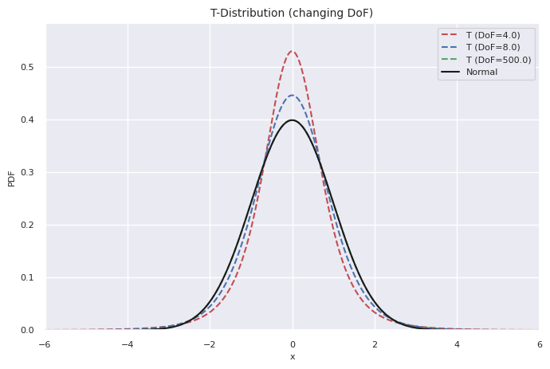

Skewed Generalised T Distribution
=================================

The Generalised Skew-T (GST) distribution (Theodossiou, 1998, https://pubsonline.informs.org/doi/10.1287/mnsc.44.12.1650) 
is a probability distribution that has parameters that allow for skewness and kurtosis. Many popular distributions are included within 
the family of distributions that can be accommodated by the Skewed Generalised T distribution.
The family of GST distributions includes the Normal distribution, the symmetric and skewed Student's T,
the Laplace, and even the Uniform distribution.

The Generalised Skew T has an analytical form for the probability density function and is far faster to calculate and fit than the 
Levy Stable distribution. 

.. math::
    f(x \lvert k, n, \lambda, \sigma^2) = 
   C(1+ (\frac{k}{n-2})\theta^{-k} (1-\lambda)^{-k} \lvert \frac{x-\mu}{\sigma} \rvert^k )^{\frac{-(n+1)}{k}}

where :math:'\mu' are distribution family parameters

Unlike the Levy-Stable distribution, the GST does not have the stability property. 
Hence, adding together variables from this family of distributions should ensure that the Classical Central
Limit Theorem is obeyed provided the parameters suggest a finite variance. 

Distribution Examples
---------------------

Here's an example of the different Laplace distributions that can be modeled with the Skewed Generalised T distribution:

And here's some of the different T-distributions that can be modeled with the family:

Fitting a Skewed Generalised T Distribution
-------------------------------------------

A Skewed Generalised T distribution can be fit to a numpy array of data using::
    # fit distribution parameters to sample data
    dist = fd.GeneralisedSkewT.fit(data_sample)
    # parameters returned are lambda, k, n, location, and scale
    
This uses the Py-BOBYQA optimisation routine to return a tuple containing the distribution parameters.