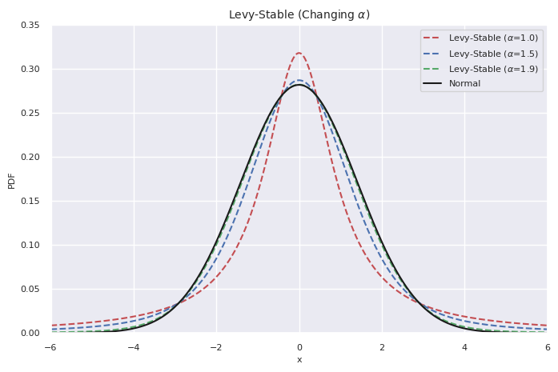

The Levy Stable Distribution
============================

The Levy Stable family of distributions is a generalisation of the Normal distribution that has parameters
that control for skewness and kurtosis. The Levy Stable is an interesting distribution because of its stability property. 
Linear combinations of a stable distribution have the same shape parameter. 
This is appealing because it allows us to present returns as having the same distribution over different time scales whilst having fat tails and skewness. 
Mandelbrot (1963, https://econpapers.repec.org/article/ucpjnlbus/v_3a36_3ay_3a1963_3ap_3a394.htm) popularised the distributions in financial markets 
with an examination of historic cotton prices. He concluded that the stability parameter (:math:`\alpha` ) was around 1.7 by examining the behaviour of the prices in the tail.

The levy stable distribution is built from its characteristic function. The probability density
function is the inverse Fourier transform of the characteristic function, where the characteristic
function has the form:

:math:`\psi(t; \alpha, \beta, \sigma) = exp(it\mu -\lvert\sigma t \rvert^{\alpha}(1 - i\beta sgn(t)\Phi))` 

:math:`\Phi = \begin{cases} \tan \left (\frac{\pi \alpha}{2} \right) & \alpha \neq 1 \\
- \frac{2}{\pi}\log(t) & \alpha = 1\end{cases}` 

Unfortunately, this formulation means that it can take some time to fit a probability density function 
using this calculation. 

Building The Grid
-----------------
This implementation is designed to allow quick fitting of the distribution to a data sample using a cubic interpolated version of the probability distribution function. The 
interpolation is based on a set of reasonable grid points:

:math:`0.4<\alpha<2.0, -1.0<\beta<1.0`, and 

:math:`-0.999\frac{\pi}{2}<tan(x)<0.999\frac{\pi}{2}`  

The set of grid points used for the interpolation can be built using::
    python build_levy_interpolator.py

This will create a set of 5 files in the directory that can be used as the grid.

Most of the code relies on the scipy stats implementation of the levy stable distribution https://docs.scipy.org/doc/scipy/reference/generated/scipy.stats.levy_stable.html. The values on the grid are calculated
using the scipy stats distribution using the :::math:`S_1` parameterization.

Distribution Example
--------------------

Here's an example of the different Levy-Stable distributions that can be modelled by changing the
kurtosis parameter (:math:`\alpha]` :

Fitting a Levy Stable Distribution
----------------------------------
A Levy Stable distribution can be fit to a numpy array of data using::

    import FastDistributions as fd
    # fit distribution parameters to sample data
    ls_fit = fd.LevyStableInterp.fit(data_sample)
    # parameters returned are alpha, beta, location, and scale
    
This uses the Py-BOBYQA optimisation routine to return a tuple containing the distribution parameters.