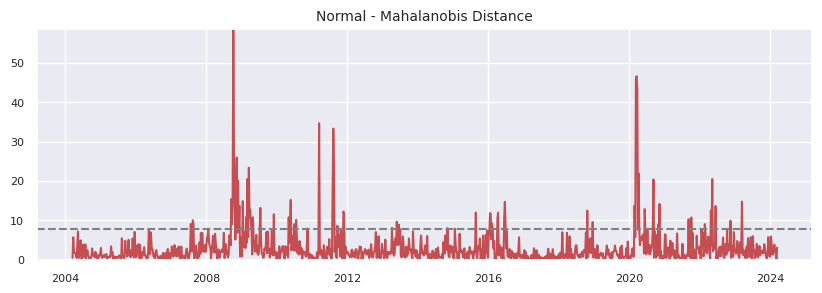

Multivariate T Distribution
===========================
The Multivariate T-Distribution uses the EM Algorithm (`Dempster, Laird & Rubin, 1977 <https://rss.onlinelibrary.wiley.com/doi/abs/10.1111/j.2517-6161.1977.tb01600.x>`_) and the 
`Multivariate T Distribution <https://en.wikipedia.org/wiki/Multivariate_t-distribution>`_ to model the returns of correlated assets when there are outliers. 

The Mahalanobis Distance is a distance measure defined for each time period using the covariance matrix - :math:`(\bf{r}_{\it{i}} - \bf{\mu})'\bf{\Sigma^{-1}}(\bf{r}_{\it{i}}-\bf{\mu})`.
Plots of the Mahalanbobis distance show that there are outliers in returns data sets. The following charts shows the Mahalanobis Distance for a set of international indices over a 20 year 
period. The horizontal line shows the 5% level for the distance. There are more breaches than expected and the breaches are clustered.

The EM Algorithm uses the Mahalanobis distance to reduce the 
impact of outliers on the calculation of correlation/covariance. Each iteration of the algorithm calculates a variance scale that is used
to downweight extreme periods. 